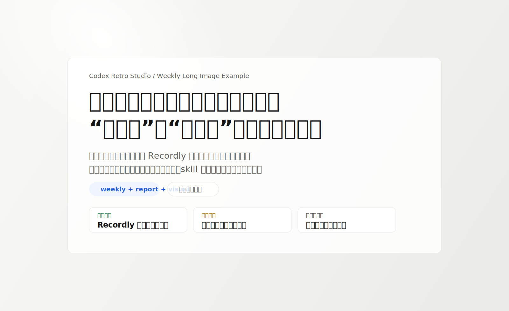

# Codex Retro Studio

> *“先把 Codex 里到底做成了什么说清楚，再把它包装成能展示、能传播、能交接的复盘成品。”*


**一个把 Codex 复盘、报告重组、PPVI 视觉包装串成一体化流程的 skill。**

适合这些场景：

- 你不只想知道“这周做了什么”，还想知道“真正产出了什么、哪些线在白白消耗上下文”
- 你想把复盘结果继续交给前端、设计、团队成员，而不是停在聊天总结
- 你想把 Codex 线程、产出、摩擦点压成报告、长图、页面结构稿

一句话理解它：

```text
它不是单纯复盘 skill，而是「复盘 -> 报告 -> 视觉重组 -> 长图/页面稿」的一条交付链。
```

[效果示例](#效果示例) · [快速开始](#快速开始) · [触发方式](#触发方式) · [它和同类有什么不同](#它和同类有什么不同) · [安全边界](#安全边界)

---

## 它解决什么问题

很多复盘 skill 只能回答“这周做了什么”，很多设计 skill 只能回答“这个页面怎么更好看”。

但真正卡人的地方是中间这段：

- 复盘结论没有被整理成报告
- 报告没有被压成适合网页/长图的结构
- 最后还是得手动再说一遍“用视觉思路重组一下”

`codex-retro-studio` 解决的是这一整段断裂：

```text
复盘判断
-> 报告结构
-> 视觉重组
-> 长图 / 页面稿
```

---

## 效果示例

这个 skill 最终不是只给你一段总结，而是会把结果逐层压成下面这种交付链：

```text
聊天复盘
-> 报告稿
-> 视觉删改建议
-> 长图 / 页面结构稿
```

首屏预览：



你第一次用它，最常见会拿到的是这 4 层结果：

1. 聊天版复盘：先告诉你到底做成了什么、没做成什么
2. 报告稿：把复盘压成能交接、能汇报的结构
3. 视觉删改建议：告诉你哪些该删、该并、该图示化
4. 长图/页面结构稿：把结果整理成适合继续设计和开发的骨架

### 示例 1：周复盘 + 报告 + 长图

输入：

```text
用 codex-retro-studio 开始周复盘，并输出报告和长图版
```

输出路径会分成 4 段：

1. 先给聊天版周复盘
2. 再压成报告结构
3. 再按 PPVI 方式判断删改与图示化
4. 最后给长图 HTML / 页面结构稿

### 示例 2：近一个月深度复盘

输入：

```text
用 codex-retro-studio 复盘近一个月 Codex 做了什么，并做成长图结构
```

预期结果：

- 看出哪些线真正闭环
- 看出哪些线一直在消耗上下文
- 得到能继续交给前端 / 设计的结构稿

更多示例见 [`examples/`](./examples/)。

其中这个文件已经是可直接打开的静态成品骨架：

- [`examples/weekly-long-image-cover.svg`](./examples/weekly-long-image-cover.svg)
- [`examples/weekly-long-image.html`](./examples/weekly-long-image.html)

---

## 快速开始

### 1. 安装

如果你是本地 Codex 用户，把这个目录放进你的 skills 目录即可。

常见本地路径：

```bash
~/.codex/skills/codex-retro-studio
```

如果你是从 GitHub 拉下来，目录结构应当像这样：

```text
~/.codex/skills/codex-retro-studio/
├── SKILL.md
├── README.md
├── LICENSE
├── test-prompts.json
├── agents/
└── examples/
```

### 2. 重启或刷新 Codex

装完之后，重启 Codex 或刷新 skills，让它重新加载本地 skill。

### 3. 立即验证

然后直接对 Codex 说：

```text
用 codex-retro-studio 开始周复盘，并输出报告和长图版
```

如果你看到输出开始按下面顺序展开，说明它已经生效：

1. 先给聊天版复盘
2. 再压成报告结构
3. 再给视觉删改建议
4. 最后才给长图或页面结构稿

如果后续你有跨工具安装流，也可以补这一类命令：

```bash
npx skills add your-org/codex-retro-studio
```

---

## 触发方式

这些说法都应该触发这个 skill：

- `开始每日复盘`
- `今日复盘`
- `开始周复盘`
- `深度周复盘`
- `近一个月复盘`
- `复盘这周 Codex 做了什么`
- `输出报告`
- `出长图`
- `做成页面结构稿`

第一次试用时，建议优先用这 3 句：

- `开始周复盘，并输出报告`
- `开始周复盘，并输出报告和长图版`
- `复盘近一个月 Codex 做了什么，并做成长图结构`

---

## 能做什么 / 它会交付什么

| 模式 | 适用场景 | 默认交付物 |
| --- | --- | --- |
| `chat review` | 只要复盘判断 | 聊天版复盘 |
| `report review` | 需要结构化结论 | 复盘 + 报告稿 |
| `visual packaging` | 需要页面/长图/汇报页 | 复盘 + 报告稿 + PPVI评审 + 长图/页面稿 |

如果你只想快速判断最近做得值不值，先用 `chat review`。

如果你想把结果拿去发团队、做汇报、做页面，再用 `report review` 或 `visual packaging`。

如果你要的是长图或页面稿，默认会压成这些区块：

1. 封面判断
2. 三个关键结论
3. 已落地 / 仅探索对照
4. 项目状态矩阵
5. 使用方式诊断
6. 摩擦因果链
7. 下一步动作格

---

## 它和同类有什么不同

| 维度 | 常见做法 | Codex Retro Studio |
| --- | --- | --- |
| 复盘范围 | 只做“今天做了什么” | 复盘 Codex 线程、产出、模式、摩擦点 |
| 包装链路 | 复盘和设计分开做 | 复盘 -> 报告 -> PPVI -> 长图 一条线走完 |
| 视觉层 | 停在普通总结 | 明确要求删、并、图示化、卡片化 |
| 交付形态 | 聊天答案 | 聊天、报告、网页、长图结构都能出 |

核心差异不是“它会复盘”，而是“它会把复盘继续压成可交付资产”。

---

## 安全边界

这个 skill：

- 不默认写入 Obsidian
- 不默认写入 `goal-journal`
- 不把个人生活复盘当作默认目标
- 不把“忙过了”伪装成“真的产出”
- 不会在复盘内容很弱时硬做花哨长图

以下情况不该用它：

- 你要的是个人目标日记
- 你只想做设计审美判断，没有复盘内容
- 你只想单独用 `ppvi` 做视觉评审

---

## 文件结构

```text
codex-retro-studio/
├── SKILL.md            # 主流程：复盘 -> 报告 -> 视觉包装
├── README.md           # 对外说明与使用入口
├── LICENSE             # MIT license
├── test-prompts.json   # 最小验证 prompts
├── agents/
│   └── openai.yaml     # UI 元数据
└── examples/
    ├── weekly-report.md
    ├── monthly-deep-review.md
    ├── weekly-long-image-cover.svg
    └── weekly-long-image.html
```

---

## 验证与测试

最小验证方式：

1. 准备一个最近做过不少 Codex 事情的线程或工作区
2. 对 Codex 说：

```text
用 codex-retro-studio 开始周复盘，并输出报告和长图版
```

合格表现应该是：

- 先有复盘判断
- 再有报告结构
- 再有 PPVI 式重组判断
- 最后才给长图或页面稿

如果它一上来就直接堆花哨页面，没有先给出复盘判断和报告结构，那就是用偏了。

结构校验示例：

```bash
python ~/.codex/skills/.system/skill-creator/scripts/quick_validate.py ~/.codex/skills/codex-retro-studio
```

---

## License

[MIT](./LICENSE)

---

*复盘不是截图聊天记录，而是把结果、判断和下一步压成可以继续推进的工作资产。*
